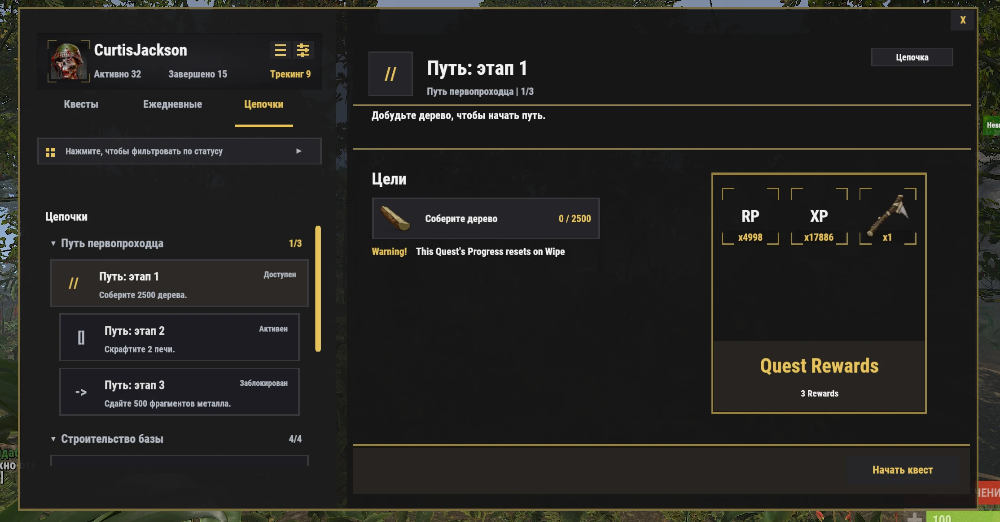

# BQuest

Языковые версии: [EN](README.md)

`BQuest` — полноэкранный плагин квестов для Rust-серверов на Oxide/uMod.

В текущем репозитории находятся:

- основной плагин в `plugins/BQuest.cs`
- данные квестов в `data/BQuest/`
- конфиг в `config/BQuest.json`
- локализация в `lang/en/BQuest.json` и `lang/ru/BQuest.json`

Этот README отражает код и данные, которые сейчас находятся в этой папке.

## Что Делает Плагин

- Открывает главное окно квестов командой `/q`
- Показывает три вкладки в UI: `Quests`, `Daily`, `Questlines`
- Поддерживает отслеживаемые квесты и перемещаемый мини-список квестов
- Поддерживает чат-сообщения и toast-уведомления о прогрессе
- Хранит прогресс игроков, кулдауны, отслеживаемые квесты и UI-настройки в JSON
- Поддерживает повторяемые квесты с индивидуальным кулдауном из JSON
- Поддерживает цепочки квестов через `QuestlineId`, `QuestlineOrder` и `RequiredQuestIds`
- Поддерживает цели на сдачу предметов через `SubmissionRequired`
- Поддерживает многоязычные названия квестов, описания и текст целей



## Структура Репозитория

- `plugins/BQuest.cs`: основной исходник плагина и fallback-билдеры
- `config/BQuest.json`: runtime-конфигурация
- `data/BQuest/Quest.json`: обычные квесты
- `data/BQuest/Daily.json`: квесты вкладки daily
- `data/BQuest/Questlines.json`: каталог цепочек квестов
- `data/BQuest/PlayerInfo.json`: данные прогресса и кулдаунов игроков
- `data/BQuest/QuestStatistics.json`: агрегированная аналитика по квестам
- `lang/en/BQuest.json`: английская локализация
- `lang/ru/BQuest.json`: русская локализация

## Текущее Наполнение

- `55` обычных квестов в `data/BQuest/Quest.json`
- `2` daily-квеста в `data/BQuest/Daily.json`
- `2` цепочки квестов в `data/BQuest/Questlines.json`

Сейчас в комплектных данных используются такие типы целей:

- `Gather`
- `Craft`
- `Delivery`
- `Deploy`
- `EntityKill`
- `Growseedlings`
- `BossMonster`
- `AirEvent`
- `SupermarketEvent`
- `HarborEvent`

## Сопоставление Целей

Сопоставление целей управляется данными.

- `Target` — основной токен для совпадения
- `MatchAliases` добавляет дополнительные допустимые имена без изменения C#
- `MatchMode` поддерживает `shortname`, `contains` и `prefab`
- `TargetSkinId` может ограничивать прогресс только конкретным скином

Для NPC или сущностей из сторонних плагинов лучше расширять `MatchAliases` в JSON, а не добавлять жёсткие исключения в код.

## Заметки По Формату Квестов

В описании квеста могут использоваться поля:

- `QuestID`
- `QuestDisplayName`, `QuestDescription`, `QuestMissions`
- `QuestDisplayNameMultiLanguage`, `QuestDescriptionMultiLanguage`, `QuestMissionsMultiLanguage`
- `QuestType`, `QuestCategory`, `QuestTabType`
- `Objectives`
- `PrizeList`
- `QuestPermission`
- `RequiredPermission`
- `RequiredQuestIds`
- `AvailabilityConditions`
- `BlockConditions`
- `QuestlineId`, `QuestlineOrder`
- `IsRepeatable`, `Cooldown`
- `AllowManualStart`, `AllowTrack`, `AllowCancel`, `AllowClaim`
- `ResetProgressOnWipe`

В описании цели могут использоваться поля:

- `ObjectiveId`
- `Type`
- `Target`
- `TargetCount`
- `Description`, `DescriptionMultiLanguage`
- `MatchAliases`
- `MatchMode`
- `TargetSkinId`
- `Hidden`
- `Order`
- `SubmissionRequired`

## Награды

Текущий код поддерживает такие типы наград:

- `Item`
- `Blueprint`
- `BlueprintItem`
- `BlueprintReward`
- `CustomItem`
- `Command`
- `RP`
- `XP`
- `BlueprintFragments`
- `Fragments`

Текущее поведение наград:

- `XP` использует `SkillTree`, если он доступен, и одновременно кладёт ту же сумму в `Economics`
- `RP` сначала использует `Economics`, затем переключается на `ServerRewards`
- `BlueprintFragments` создаёт предмет `blueprintfragment`
- Награды типа `Command` заменяют `%STEAMID%` на SteamID игрока

## Команды

Публичная команда для игрока:

- `/q`

Админские covalence-команды:

- `bquest.player.reset <steamid64>`
- `bquest.stat`

Устаревшие чат-команды в текущем коде не регистрируются:

- `/quest`
- `/qlist`

## Права

Базовое право:

- `BQuest.default`

Дополнительно права на отдельные квесты могут генерироваться из JSON через `QuestPermission`, а также квест может требовать любое внешнее право через `RequiredPermission`.

## Интеграции

Сейчас в коде есть три разных уровня интеграции.

Прямые API-интеграции, которые реально вызываются через `PluginReference`:

- `Economics`
- `ServerRewards`
- `SkillTree`
- `Notify`
- `IQChat`
- `Friends`
- `Clans`
- `EventHelper`
- `Battles`
- `Duel`
- `Duelist`
- `ArenaTournament`

Hook-only совместимость с внешними плагинами или event-системами:

- `CustomVendingSetup` через `OnCustomVendingSetupGiveSoldItem`
- обычные NPC/vending продажи через `OnNpcGiveSoldItem`
- `RaidableBases` через `OnRaidableBaseCompleted`
- hook на убийство босса через `OnBossKilled`
- `IQDronePatrol` через `OnDroneKilled`
- `IQDefenderSupply` через `OnLootedDefenderSupply`
- хуки победителей событий: `OnAirEventWinner`, `OnSupermarketEventWinner`, `OnHarborEventWinner`, `OnSatDishEventWinner`, `OnSputnikEventWin`, `OnGasStationEventWinner`, `OnTriangulationWinner`, `OnFerryTerminalEventWinner`, `OnConvoyEventWin`, `OnCaravanEventWin`

Объявленные `PluginReference`, которые сейчас напрямую не используются в коде:

- `MarkerManager`
- `BossMonster`
- `CustomVendingSetup`
- `RaidableBases`
- `IQDronePatrol`
- `IQDefenderSupply`

Прогресс за PvP-убийства исключает дружественные и event-сценарии, если соответствующие интеграции доступны. Сейчас используются проверки для:

- `Friends`
- `Clans`
- `EventHelper`
- `Battles`
- `Duel`
- `Duelist`
- `ArenaTournament`

## Хранение Данных

Состояние игрока хранится в `data/BQuest/PlayerInfo.json`, включая:

- активные квесты
- завершённые квесты
- кулдауны
- отслеживаемые квесты
- настройки уведомлений
- позицию мини-UI
- состояние получения наград

Аналитика хранится отдельно в `data/BQuest/QuestStatistics.json`.

Не путайте сброс аналитики со сбросом прогресса игроков.

## Вайпы И Сбросы

- Если `settings.useWipe` равно `true`, прогресс квестов игроков очищается в `OnNewSave`
- Если `settings.useWipePermission` равно `true`, на вайпе отзываются выданные quest-specific права
- Отдельные квесты могут использовать `ResetProgressOnWipe`
- Кулдаун повторяемых квестов всегда берётся из собственного поля `Cooldown` этого квеста

Daily-квесты — это отдельная UI/data-категория. В текущем коде для них нет отдельного midnight-reset механизма; доступность по-прежнему определяется обычными правилами завершения и кулдауна.

## Ключевые Пункты Конфига

Заметные опции из `config/BQuest.json`:

- лимит активных квестов: `settings.questCount`
- лимит отслеживаемых квестов: `settings.TrackedQuestLimit`
- лимит виджета кулдаунов: `settings.CooldownListLimit`
- режим уведомлений по умолчанию: `settings.DefaultNotificationMode`
- позиция уведомлений: `settings.NotificationPosition`
- публикация статистики: `statisticsCollectionSettings.*`
- пагинация и видимость списков: `ui.*`
- настройки уведомлений по умолчанию: `notifications.*`
- цвета UI: `theme.*`

## Установка

1. Поместите `plugins/BQuest.cs` в `oxide/plugins/`
2. Поместите содержимое `data/BQuest/` в `oxide/data/BQuest/`
3. Поместите `config/BQuest.json` в `oxide/config/`
4. Поместите `lang/en/BQuest.json` и `lang/ru/BQuest.json` в соответствующие папки `oxide/lang/`
5. Загрузите плагин командой `oxide.load BQuest`
6. При необходимости выдайте базовое право:

```text
oxide.grant group default BQuest.default
```

## Рекомендации По Редактированию

При изменении контента в этом репозитории:

- по возможности меняйте JSON-данные квестов, а не хардкодьте контент-логику в C#
- держите `data/BQuest/Quest.json` и `data/BQuest/Daily.json` синхронизированными с default/fallback-билдерами в `plugins/BQuest.cs`
- держите `data/BQuest/Questlines.json` синхронизированным с questline-defaults в `plugins/BQuest.cs`
- обновляйте README, если заметно меняется поведение команд, маршрутизация наград, хранение данных или формат данных

## Дополнительные Документы

- English-версия инструкции: `docs/QUEST_AUTHORING.md`
- инструкция по созданию квестов: `docs/QUEST_AUTHORING_RU.md`
